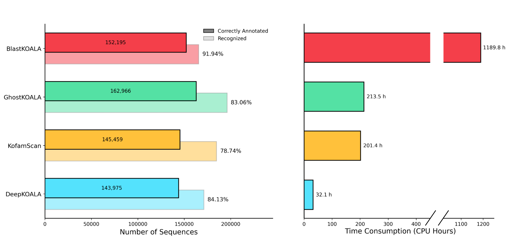
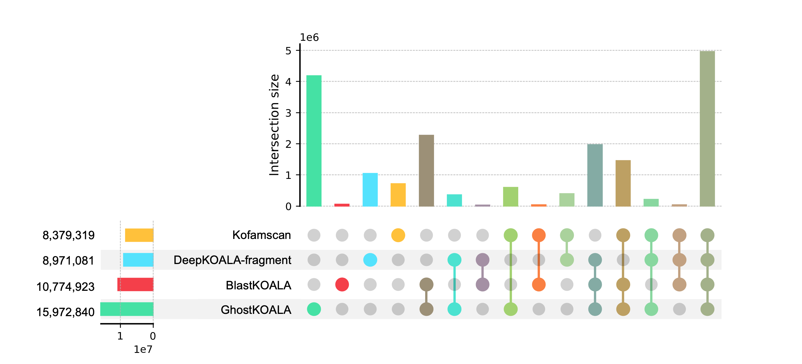

# DeepKOALA
### Beta Version
**An ultra-fast and accurate tool for KEGG Orthology (KO) assignment, powered by deep learning.**

### Table of Contents
* [About the Project](#about-the-project)
* [Performance](#performance)
* [Installation](#installation)
* [Usage](#usage)
* [How to Cite](#how-to-cite)
* [License](#license)

## About the Project
**DeepKOALA** is a high-performance deep learning-based tool for rapid protein function annotation according to the **KEGG Orthology (KO)** system. By framing KO assignment as an open-set recognition problem, it can effectively distinguish between known and unknown functional sequences, thereby reducing false-positive annotations.

Built on a Gated Recurrent Unit (GRU) architecture, the tool provides excellent computational efficiency while ensuring high accuracy. In this beta version, DeepKOALA offers two operational models:

* **`full` model**: Delivers high-precision annotation for complete protein sequences.
* **`fragment` model**: Specially optimized for handling fragmented sequences common in metagenomic data, significantly improving the recognition rate and accuracy for incomplete sequences.


## Performance

### Comparison with Mainstream Tools



On an independent test set, DeepKOALA is up to **37.5 times faster** than BlastKOALA while maintaining a comparable or superior precision (84.13%) to tools like KofamScan (78.74%) and GhostKOALA (83.06%).

### Application on Metagenomic Datasets



**`fragment` model** is optimized for fragmented sequences. It can annotate the 46 million proteins of the OM-RGC v2 catalog in approximately 30 minutes and additionally identifies over 1 million sequences missed by other mainstream tools.


## Installation

### Prerequisites
- [x] Git
- [x] Python >= 3.11
- [x] (For GPU users) NVIDIA graphics driver


### 1. Clone the Repository

First, clone the source code from GitHub to your local machine and navigate into the project directory.

```bash
git clone https://github.com/zhaoxi120/deepkoala
cd deepkoala
```

### 2. Create and Activate the Virtual Environment

Create an independent Python virtual environment named deepkoala_env inside the project directory.

For MacOS/Linux users:
```bash
python3 -m venv deepkoala_env
source deepkoala_env/bin/activate
```

For Windows users:
```bash
python3 -m venv deepkoala_env
.\deepkoala_env\Scripts\activate
```

After activation, you will see (deepkoala_env) at the beginning of your terminal prompt.


### 3. Install Dependencies

We use the `requirements.txt` file to manage most of the project's dependencies. Run the following command to install them:
```bash
pip install -r requirements.txt
```

> [!WARNING]
> **For GPU Users (Manual PyTorch Installation Required):**
> 1. Prepare the dependency file. Open `requirements.txt`, comment out the line for `torch` by adding a `#` at the beginning, and save the file.
> ```txt
> numpy==1.26.3
> pandas==2.2.2
> # torch==2.4.1
> tqdm==4.66.4
> ```
> 2. Install all other dependencies by running the following command:
> ```bash
> pip install -r requirements.txt
> ```
> 3. Check your system's GPU compatibility. Run `nvidia-smi` to find the maximum CUDA Version your driver supports.
> 4. Finally, install a compatible PyTorch version. Visit the [Official PyTorch Website](https://pytorch.org/), find the command for a CUDA version that is less than or equal to your driver's, and run it. For example, install PyTorch 2.4.1 with GPU Support:
> ```bash
> pip install torch==2.4.1 --index-url https://download.pytorch.org/whl/cu121
> ```

### 4. Download Pre-trained Models

The pre-trained model file (version February 2025) is already included in this beta version of the project. No separate download is required.


## Usage

### Basic Usage

The primary way to use DeepKOALA is via its command-line interface.

```bash
python3 -m deepkoala.cli -i <input.fasta> -o <results.csv> [OPTIONS]
```

### Example

To annotate a set of proteins using the default settings:

```bash
python3 -m deepkoala.cli -i my_proteins.fasta -o results.csv
```

To annotate metagenomic genes using the specialized model and get a detailed output:

```bash
python3 -m deepkoala.cli -i metagenome.fasta -o detailed_results.csv --model frag --output_format detail
```

### Command-Line Options

* `--input_path` `-i`: Path to the input protein FASTA file. **(Required)**
* `--output_path` `-o`: Path for the output CSV results file. **(Required)**
* `--model` `-m`: Sets the prediction model. (Default: `full`)
  * `full`: Standard model, optimized for complete protein sequences.
  * `frag`: Specialized model, trained to better handle fragmented sequences common in metagenomics.
* `--date` `-d`: Specifies the version of the pre-trained model to use. (Default: `latest`, which loads the latest available model).
* `--batch_size` `-bs`: Number of sequences to process in a single batch. Larger values can be faster on GPUs but use more memory. (Default: `32`).
* `--num_workers` `-nw`: Number of worker processes for data loading. Can accelerate processing on some systems. (Default: `2`).
* `--output_format` `-of`: Determines the columns in the output file. (Default: `simple`)
  * `simple`: A concise format that only shows the predicted KO label (`predict_label`) for sequences that meet the confidence threshold. Other predictions are left blank.

       | name                     | predict_label |
       | :---:                    | :---:         |
       | T04784_FRACYDRAFT_201661 | K25156        |
       | T04784_FRACYDRAFT_233513 |               |
    
  * `detail`: A comprehensive format that shows the top prediction for every sequence, its probability score, the required confidence threshold, and an asterisk (`*`) in the `annotate` column if the prediction is confident (`probability` >= `threshold`).
  
       | name                     | predict_label | probability | threshold | annotate |
       | :---:                    | :---:         | :---:       | :---:     | :---:    |
       | T04784_FRACYDRAFT_201661 | K25156        | 0.999643    | 0.659121  | *        |
       | T04784_FRACYDRAFT_233513 | K15259        | 0.689804    | 0.921019  |          |

   * `detail` (when `--multi` is enabled): Displays the start and end positions of each domain.

       | name                            | predict_label | probability | threshold | start | end  | annotate |
       | :---:                           | :---:         | :---:       | :---:     | :---: | :---:| :---:    |
       | Caldivirga_maquilingensis_A1_A2 | K03041        | 0.742483    | 0.61305   | 15    | 902  | *        |
       | Caldivirga_maquilingensis_A1_A2 | K03042        | 0.999944    | 0.882147  | 910   | 1275 | *        |

* `--multi`: Enables an optional multi-domain validation mode that uses profile HMMs to precisely define the boundaries of each domain (disabled by default).
* `--profiles_dir` `--pd`: Provides the directory containing the required HMM profiles when multi-domain mode is enabled.

> [!WARNING]
> **For Multi-domain Mode Users:**
> 1. Please install [HMMER](http://hmmer.org/) and confirm that `hmmsearch` can be run from the command line.
> 2. Download `profiles.tar.gz` from [KOfam](https://www.genome.jp/ftp/db/kofam/archives/2025-02-01/) and extract it.
> 3. Write the path of the extracted folder into the default value at line 21 of `deepkoala/cli.py`.
> ```python
>     p.add_argument(
>       '--profiles_dir',
>       '-pd',
>       default='',     # <-- replace with your actual path
>       help='Directory containing KO-specific HMM profiles (multi-domain mode only)',
>   )
> ```

## How to Cite

The paper describing DeepKOALA is currently in preparation and will be published soon. In the meantime, if you use this software, please cite this GitHub repository.

We will update this section with formal citation information as soon as it is available.

## License

This software is released under the [MIT License](./LICENSE).


